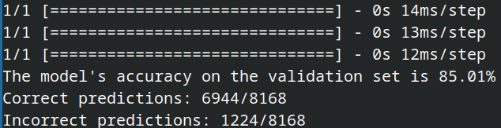

# Parallel GPU-Enabled CNN with cuDNN: Optimized Deep Learning for Image Classification

<div style="text-align: center;">


</div>

By @ShinjiMC - Braulio Nayap Maldonado Casilla

### Setting up Anaconda Environment

1. **Install Anaconda:**
   If Anaconda is not installed, follow these steps:

   - Download Anaconda from [Anaconda's website](https://www.anaconda.com/products/distribution).
   - Follow the installation instructions for your operating system.

2. **Create and Activate Environment:**
   Open a terminal and execute the following commands:
   ```bash
   conda create --name flowers python=3.8
   conda activate flowers
   ```

### Installing Required Packages

3. **Install TensorFlow with GPU support:**
   ```bash
   conda install -c conda-forge tensorflow-gpu
   ```
4. **Install Additional Packages:**
   ```bash
   conda install matplotlib scipy
   ```

### Verify TensorFlow GPU Setup

5. **Run verification script (verification.py):**

   ```python
   import tensorflow as tf

   # Check if TensorFlow detects the GPU
   physical_devices = tf.config.experimental.list_physical_devices('GPU')
   print("Num GPUs Available: ", len(physical_devices))
   if len(physical_devices) > 0:
       tf.config.experimental.set_memory_growth(physical_devices[0], True)
       print("GPU is available and will be used for training.")
   else:
       print("No GPU found, using CPU for training.")
   ```

### Download and Prepare Dataset

6. **Download Dataset:**

   - Download the dataset from [Kaggle](https://www.kaggle.com/datasets/jonathanflorez/extended-flowers-recognition?resource=download).

7. **Prepare Dataset (distribution.py):**

   - After downloading, extract the dataset to obtain the 'flowers' folder.
   - Run the distribution script to organize images into train, validate, and test folders.

   ```bash
   python distribution.py
   ```

### Training the Model

8. **Run Main Script:**
   - Execute main.py to train your CNN model.
   ```bash
   python main.py
   ```

### Results

#### Model Distribution Summary


The summary of the model shows the division into 4 parallel processes for execution on the GPU. It demonstrates successful detection and utilization of the GPU, specifically tested on the NVIDIA GeForce RTX 4050 Laptop GPU.

#### Execution and Validation Results


The graph depicts the execution of each layer and its validation results over 20 epochs. It illustrates the progress of accuracy and loss metrics throughout the training process.

#### Training and Validation Metrics


The linear graphs show the progression of both accuracy and loss metrics during training. They highlight how the model improves as training progresses.

### Testing Your Trained Model

To test the trained model, execute `gui.py`. This script will randomly select an image from the test folder or you can select your own file and display the model's prediction alongside the actual result. The results you can view in the GUI with QT.


### Testing Confidence

You can test the model using `test.py`, which executes tests and validates the number of correct and incorrect predictions. This allows us to assess the confidence of the trained model.

The model achieved an accuracy of 85.01%, correctly predicting 6944 out of 8168 test samples, with 1224 incorrect predictions.



## License:

This project is licensed under [Creative Commons Atribución-NoComercial-CompartirIgual 4.0 Internacional](http://creativecommons.org/licenses/by-nc-sa/4.0/):

<a rel="license" href="http://creativecommons.org/licenses/by-nc-sa/4.0/">
  
</a>
